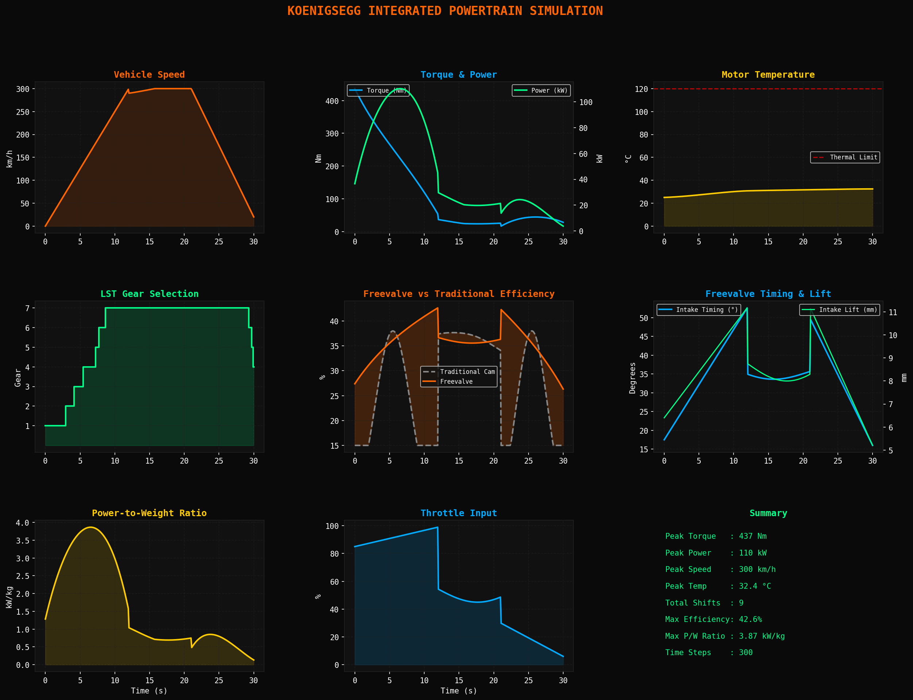
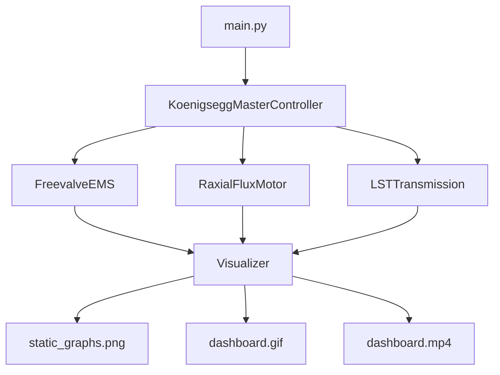
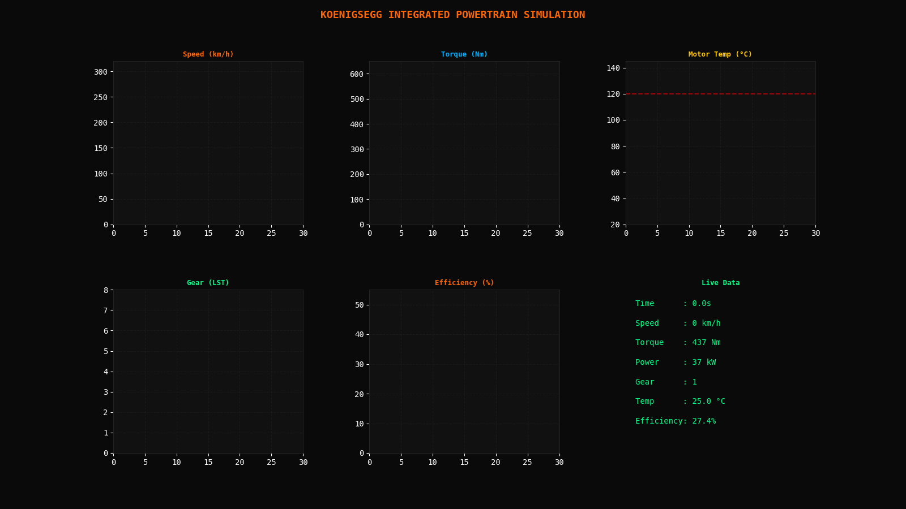

# Koenigsegg Integrated Powertrain Simulation

> **© 2026 MIz-1 — All Rights Reserved. Viewing permitted, usage prohibited. See LICENSE.**

A software-defined simulation of three Koenigsegg core technologies, integrated into a single unified powertrain model.

---

## Architecture

---

## Modules

### Module 1 — Freevalve EMS
Simulates Koenigsegg's camless engine technology. Each valve is independently controlled with dynamic timing, lift, and duration based on real-time inputs.
- Dynamic intake/exhaust valve timing
- Variable valve lift (4mm–12mm)
- Efficiency comparison: Freevalve vs Traditional Cam
- Max efficiency achieved: **42.6%**

### Module 2 — Raxial Flux Motor (Quark-inspired)
Digital twin of Koenigsegg's Raxial Flux topology — combining axial (high torque) and radial (high RPM) flux characteristics.
- Peak torque: **437 Nm**
- Peak power: **110 kW**
- Motor mass: **28.5 kg**
- Thermal simulation with cooling model
- Torque vectoring across 4 independent corners
- Max power-to-weight: **3.87 kW/kg**

### Module 3 — LST Transmission
Predictive shifting algorithm inspired by Koenigsegg's Light Speed Transmission — non-sequential gear changes in 2ms.
- 7-speed non-sequential shifting
- AI-driven optimal gear prediction
- Light Speed shift time: **2ms** vs traditional **200ms**
- Total shifts in drive cycle: **9**

---

## Drive Cycle
0 → 300 km/h acceleration → high-speed cruise → deceleration over 30 seconds.

---

## Outputs
| File | Description |
|------|-------------|
| `outputs/static_graphs.png` | 9-panel static dashboard |
| `outputs/dashboard.gif` | Animated real-time dashboard |
| `outputs/dashboard.mp4` | Full HD MP4 video |

---

## Stack

---

## Author
**MIz-1** — Self-taught Sim Developer  
Automotive Simulation Series | Phase 5

> Inspired by Koenigsegg's engineering philosophy:
> *"If it doesn't exist, invent it."*

## Live Dashboard Preview

